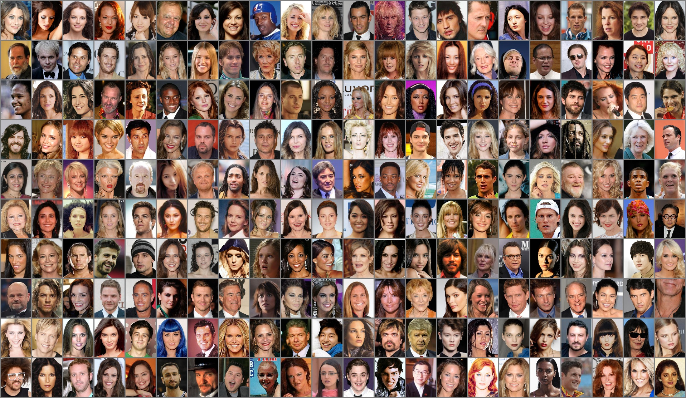

## The Tiny Portraits Dataset & Challenge

* Team Zalando Research
* August-September 2021

### Synopsis

*Tiny Portraits* is a collection of image thumbnails depicting faces, together
with some annotation relating to gender and hair, intended for rapid experimentation 
with deep learning computer vision algorithms, even in the absence
of GPU acceleration.

### The Dataset

The dataset consists of 134,734 thumbnail images of size 108 x 84 pixels, stored in PNG format,
depicting faces in a 'passport photo' style.  Here is a random sample of the data:

Each thumbnail is annotated with up to three attributes:  The apparent physical gender
of the person shown, their hair color, and their hair type (straight, wavy, or bald).
The annotations, together with an image index that links them to the thumbnail file,
are collected in a CSV file (`Tiny_Portraits_Attributes.csv`).

### The Challenge

We would like you to come up with models that can predict the gender and hair attributes
of the depicted person, or perhaps even generate similar looking 'portraits.'  For the
details of the task, please refer to the included
[Challenge Notebook](Tiny%20Portraits%20-%20The%20Challenge.ipynb).

### Download the Image Data

The entire image data is packaged separately, as multiple ZIP archives in the following
[Google Drive folder](https://drive.google.com/drive/folders/1kJtRHeUj7hCGqqOsSfHdpp85xeBHj21w?usp=sharing).
To prepare it for experiments, you can either

* create a subfolder `Tiny_Portraits_Images` in this repository, 
  download all archives in the Google Drive folder, and extract them into 
  `Tiny_Portraits_Images` directly, or
* create a subfolder `Tiny_Portraits_Zipfiles` in this repository, download the 
  archives from Google Drive, place them in this folder, and run 
  [a short Jupyter notebook](Tiny%20Portraits%20-%20Unpack%20Thumbnail%20Images.ipynb)
  that executes the zip extraction operation for you.

### Tools

To check success, and to give an idea about the *Tiny Portraits* dataset, we provide
another [brief script](Tiny%20Portraits%20-%20Sampling%20Notebook.ipynb) that loads 
the annotation data and displays images and tags for randomly selected elements of the 
dataset.

### Disclaimer

The *Tiny Portraits* dataset is derived from the original web images used in the well-known
[CelebA dataset](http://mmlab.ie.cuhk.edu.hk/projects/CelebA.html)
through automated face tagging, sampling, cropping, and scaling.

*Tiny Portraits* is provided by Zalando Research solely for developing and
testing proprietary machine learning algorithms in the field of computer vision, 
and **must not be copied, published, distributed, or sold**.
As the source images have originally been obtained from the Internet,
**Zalando Research does not own the images, nor do we endorse content or annotations**.
